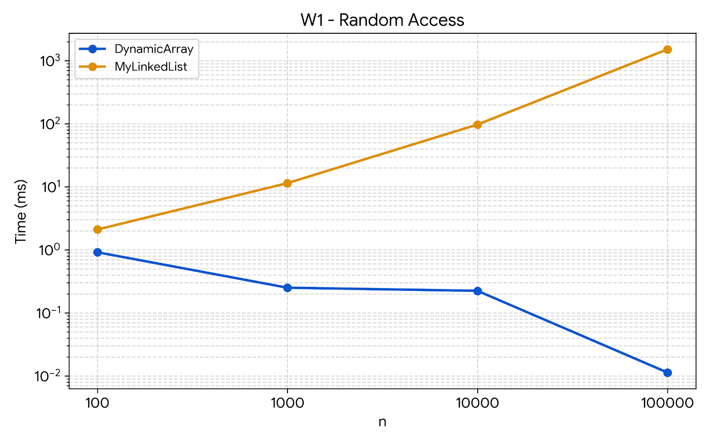
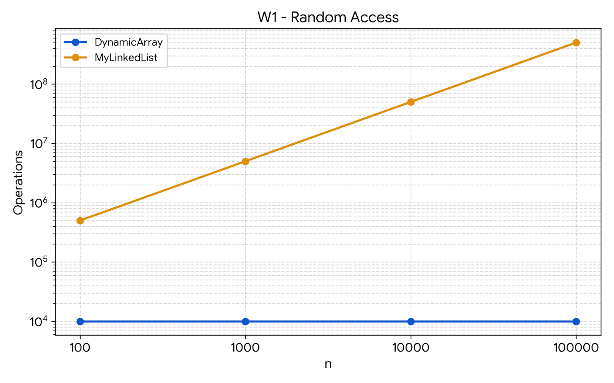
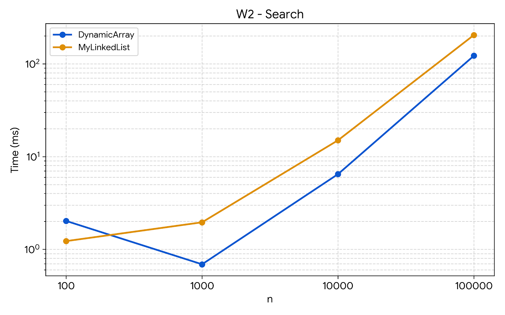
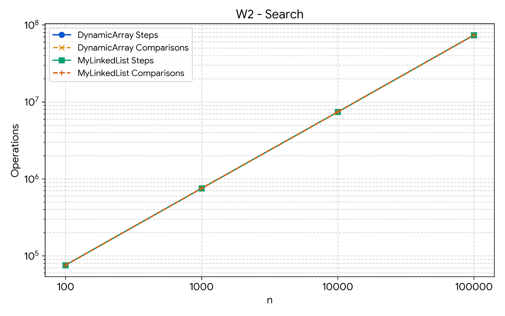
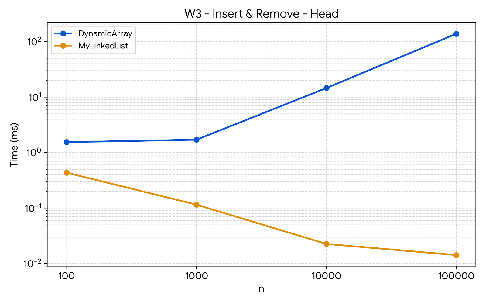
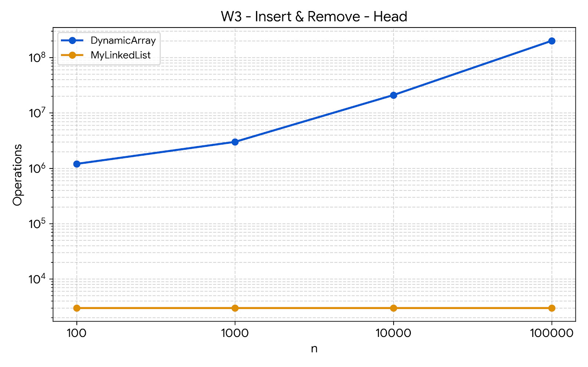
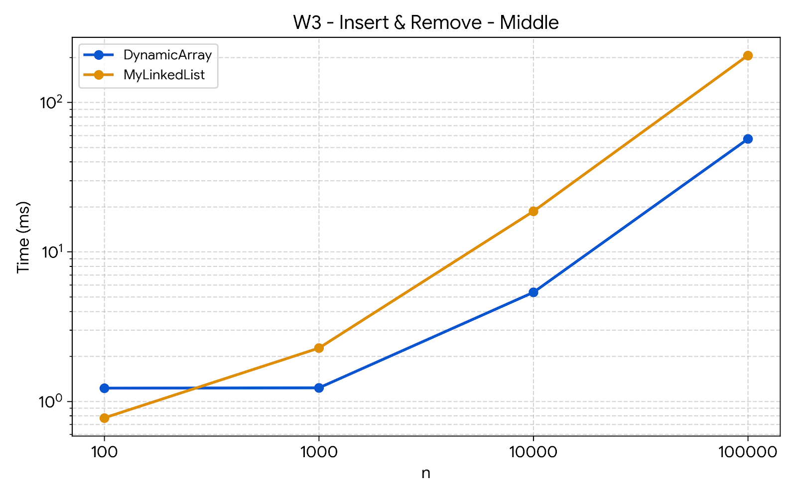
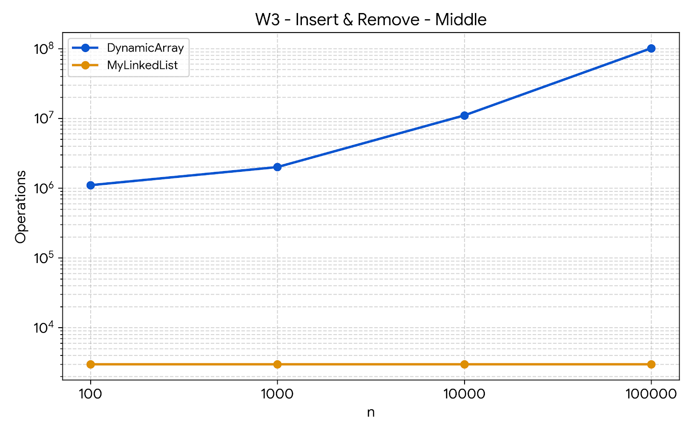
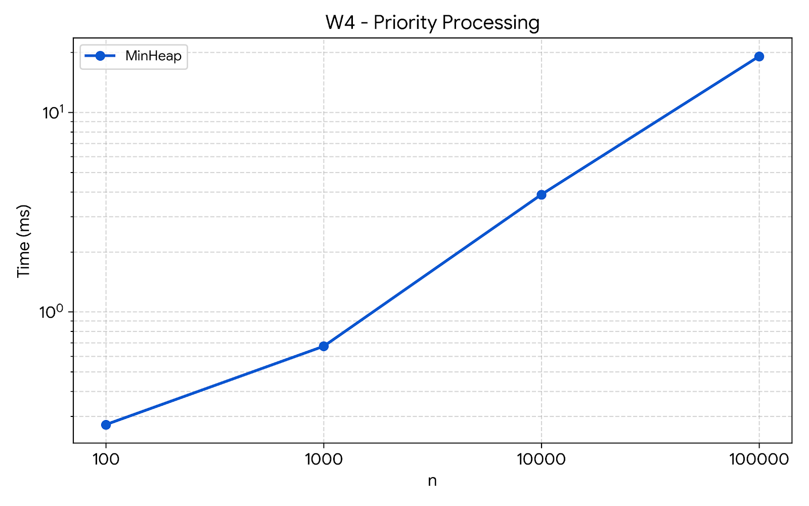
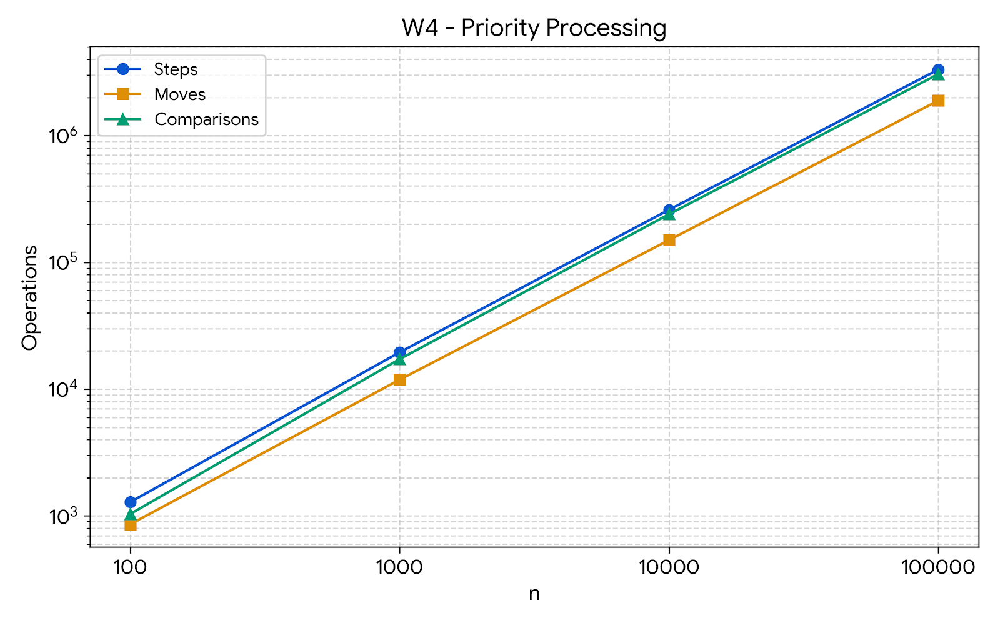

# DAA Assignment 2 - Data Structures

## 1. Introduction

This assignment implements three data structures from scratch for an in-memory workload engine:

* `DynamicArray`
* `MyLinkedList`
* `MinHeap`

The main goal is to compare their theoretical complexity and practical performance under different workloads.

All structures store primitive `int` values. Java collection classes such as `ArrayList`, `LinkedList`, and `PriorityQueue` were not used.

The implementation is written in Java 17 and uses Maven and JUnit 5 for testing.

Four workloads are used:

1. W1 - Random Access
2. W2 - Search
3. W3 - Insert and Remove
4. W4 - Priority Processing

The benchmark uses the same random seed, `new Random(42)`, for reproducible input generation.

---

## 2. Data Structures

### 2.1 DynamicArray

`DynamicArray` stores elements in a primitive `int` array.

When the array becomes full, a new array with twice the capacity is created and the existing elements are copied into it.

The implemented operations are:

* `add(x)`
* `add(index, x)`
* `remove(index)`
* `get(index)`
* `contains(x)`

The main advantage of a dynamic array is constant-time indexed access because an element can be accessed directly using its index.

The main disadvantage is that insertion or removal in the beginning or middle can require shifting many elements.

---

### 2.2 MyLinkedList

`MyLinkedList` is implemented as a singly linked list.

Each node contains:

* an `int` value
* a reference to the next node

The implemented operations are:

* `add(x)`
* `add(index, x)`
* `remove(index)`
* `get(index)`
* `contains(x)`

The list starts from the `head` node. To reach an arbitrary index, the implementation follows links one by one from the beginning.

The main advantage is efficient insertion and removal at the head because only links need to be changed.

The main disadvantage is slow indexed access caused by pointer traversal.

---

### 2.3 MinHeap

`MinHeap` is an array-based binary min-heap.

The smallest value is stored at the root at index `0`.

For every parent and child:

```text
heap[parent] <= heap[child]
```

The main operations are:

* `insert(x)` - places the value at the end and uses bubble-up.
* `peekMin()` - returns the root.
* `extractMin()` - removes the root and restores the heap using bubble-down.

The heap is useful for priority processing because the minimum value is always available at the root.

An additional Floyd `buildHeap()` method was implemented as a bonus.

---

## 3. Complexity Analysis

The following table gives the theoretical complexity of every required operation.

| Structure    | Operation       | Best |        Average |    Worst |    Auxiliary Space | Justification                                                             |
| ------------ | --------------- | ---: | -------------: | -------: | -----------------: | ------------------------------------------------------------------------- |
| DynamicArray | `add(x)`        | Θ(1) | Θ(1) amortized |     Θ(n) | O(n) during resize | Usually writes at the end; resizing copies all existing elements.         |
| DynamicArray | `add(index,x)`  | Θ(1) |           Θ(n) |     Θ(n) | O(n) during resize | Elements after the index may need to be shifted.                          |
| DynamicArray | `remove(index)` | Θ(1) |           Θ(n) |     Θ(n) |               O(1) | Elements after the removed position may need to be shifted.               |
| DynamicArray | `get(index)`    | Θ(1) |           Θ(1) |     Θ(1) |               O(1) | Array indexing directly calculates the required position.                 |
| DynamicArray | `contains(x)`   | Θ(1) |           Θ(n) |     Θ(n) |               O(1) | Search can stop at the first matching element or scan the whole array.    |
| MyLinkedList | `add(x)`        | Θ(1) |           Θ(n) |     Θ(n) |               O(1) | The implementation has no tail pointer, so it traverses to the last node. |
| MyLinkedList | `add(index,x)`  | Θ(1) |           Θ(n) |     Θ(n) |               O(1) | The node before the required position must be reached.                    |
| MyLinkedList | `remove(index)` | Θ(1) |           Θ(n) |     Θ(n) |               O(1) | The previous node must be reached before changing its link.               |
| MyLinkedList | `get(index)`    | Θ(1) |           Θ(n) |     Θ(n) |               O(1) | Nodes are visited sequentially from the head.                             |
| MyLinkedList | `contains(x)`   | Θ(1) |           Θ(n) |     Θ(n) |               O(1) | The list may need to be scanned completely.                               |
| MinHeap      | `insert(x)`     | Θ(1) |       O(log n) | Θ(log n) | O(n) during resize | The new value may remain at the bottom or move toward the root.           |
| MinHeap      | `peekMin()`     | Θ(1) |           Θ(1) |     Θ(1) |               O(1) | The minimum value is always at index 0.                                   |
| MinHeap      | `extractMin()`  | Θ(1) |       O(log n) | Θ(log n) |               O(1) | The replacement value may move down the heap.                             |

The dynamic array uses amortized analysis for `add(x)`. Most insertions take constant time, while occasional resizing takes linear time. Since capacity doubles, the total cost over many insertions gives an amortized Θ(1) operation.

For `MinHeap`, the height of a binary heap is logarithmic, so bubble-up and bubble-down take at most O(log n) time.

The auxiliary space column describes additional temporary space used by an operation rather than the storage required by the complete data structure.

---

## 4. Loop Invariant Proofs

### 4.1 DynamicArray `contains(x)`

The implementation searches through the array using a loop.

#### Invariant

Before every iteration with index `i`, all positions from `0` to `i - 1` have already been checked and none of them contains `x`.

#### Initialization

Before the first iteration, `i = 0`.

There are no positions before index `0`, so the invariant is true.

#### Maintenance

During an iteration, the value at position `i` is checked.

If the value equals `x`, the method immediately returns `true`.

Otherwise, position `i` has been checked and does not contain `x`. After increasing `i`, all positions before the new `i` have been checked and none contains `x`.

Therefore, the invariant is preserved.

#### Termination

The loop terminates either when `x` is found or when `i` reaches the size of the array.

If `i` reaches the size, every array position has been checked and none contains `x`.

#### Conclusion

Therefore, `contains(x)` returns `true` exactly when `x` exists in the `DynamicArray`, and returns `false` otherwise.

---

### 4.2 MinHeap `bubbleDown`

`bubbleDown` is used after removing the minimum element from the heap.

#### Invariant

Before every iteration of `bubbleDown`, the subtree rooted at the current index may violate the heap property only at the current node, while the affected child subtrees are already valid heaps.

#### Initialization

After `extractMin`, the last element is moved to the root.

The rest of the heap was already a valid min-heap before the extraction, so the only possible violation is at the new root.

Therefore, the invariant is true before the first iteration.

#### Maintenance

The algorithm compares the current node with its existing children and selects the smaller child.

If the current node is already smaller than or equal to both children, the heap property is restored and the loop terminates.

Otherwise, the current node is swapped with the smaller child.

The possible violation then moves one level down to the new current position, while the previous position becomes valid.

Therefore, the invariant is preserved.

#### Termination

The loop terminates when the current node is smaller than both children or when the current node becomes a leaf.

At this point there is no remaining heap violation.

#### Conclusion

Therefore, after `bubbleDown`, the entire structure satisfies the min-heap property.

---

## 5. Testing

JUnit 5 tests were created for all three main data structures.

The tests cover:

* normal operations
* random data
* empty structures
* one-element structures
* duplicate values
* first and last positions
* invalid indexes
* heap property
* sorted output after repeated extraction
* Floyd `buildHeap()`

The final test run produced:

```text
Tests run: 18
Failures: 0
Errors: 0
Skipped: 0
BUILD SUCCESS
```

The 18 tests consist of:

* 5 `DynamicArrayTest`
* 5 `MyLinkedListTest`
* 5 `MinHeapTest`
* 3 `FloydHeapTest`

All tests passed successfully.

---

## 6. Benchmark Methodology

The benchmark tests the following sizes:

```text
100
1,000
10,000
100,000
```

The benchmark uses:

```java
new Random(42)
```

This makes the generated input reproducible.

Each measured benchmark case uses:

* 1 warm-up run
* 5 measured runs
* median measured time

The first run is discarded because it can be affected by JVM warm-up.

The benchmark saves results to:

```text
results/results.csv
```

The CSV format is:

```text
workload,variant,structure,n,time_ms,steps,moves,comparisons
```

The metric definitions are:

* `steps` - one array cell read or one move to the next linked-list node
* `moves` - one element shift or one pointer/link update
* `comparisons` - one comparison between two elements

Counters are updated inside the data structure operations rather than being estimated after the benchmark.

---

## 7. Workload Results

### 7.1 W1 - Random Access

W1 fills both `DynamicArray` and `MyLinkedList` and then performs 10,000 random `get(index)` operations.

`DynamicArray` provides direct indexed access, so every `get` requires one array access.

`MyLinkedList` must start from the head and follow links until it reaches the requested index.

The difference becomes very large as `n` increases.

For `n = 100,000`:

```text
DynamicArray:
time = 0.0113 ms
steps = 10,000

MyLinkedList:
time = 1519.9857 ms
steps = 502,489,208
```

This result strongly demonstrates the difference between Θ(1) array access and Θ(n) linked-list access.





---

### 7.2 W2 - Search

W2 performs 1,000 `contains(x)` queries.

Half of the queries use values that are present and half use values that are not present.

Both structures use linear search, so the number of comparisons is the same for both structures.

For `n = 100,000`, both structures perform:

```text
73,728,608 comparisons
```

The measured times are:

```text
DynamicArray: 122.3648 ms
MyLinkedList: 204.5776 ms
```

The DynamicArray is faster because its elements are stored contiguously in memory.

The linked list requires pointer chasing between separate nodes.





---

### 7.3 W3 - Insert and Remove at Head

W3 performs 1,000 insertions and 1,000 removals at index `0`.

For the DynamicArray, insertion at the head requires shifting existing elements to the right.

Removal from the head requires shifting elements to the left.

For `n = 100,000`, DynamicArray performs:

```text
200,999,000 moves
```

MyLinkedList only needs to update the head links.

For `n = 100,000`, MyLinkedList performs:

```text
3,000 moves
```

The measured times are:

```text
DynamicArray: 137.6535 ms
MyLinkedList: 0.0142 ms
```

Therefore, MyLinkedList is much more suitable for frequent insertions and removals at the head.





---

### 7.4 W3 - Insert and Remove in the Middle

The second W3 variant performs operations at index `n / 2`.

DynamicArray must shift elements after the middle position.

MyLinkedList does not shift elements, but it must traverse the list to reach the middle position.

For `n = 100,000`:

```text
DynamicArray:
time = 56.9653 ms
moves = 100,999,000

MyLinkedList:
time = 206.4345 ms
steps = 99,998,000
```

This demonstrates an important practical difference.

Although linked lists avoid element shifting, they still have to traverse many nodes to reach the requested position.

As a result, the DynamicArray is faster in this benchmark despite performing many element moves.





---

### 7.5 W4 - Priority Processing

W4 uses the `MinHeap`.

The benchmark inserts `n` values into the heap and then extracts the minimum value `n` times.

The extracted sequence is checked to ensure that it is in non-decreasing order.

For `n = 100,000`, the benchmark records:

```text
time = 19.1469 ms
steps = 3,322,955
moves = 1,892,010
comparisons = 3,059,125
```

The result confirms that the heap can efficiently support priority-based processing.

`peekMin()` provides constant-time access to the minimum, while `insert()` and `extractMin()` require logarithmic time in the worst case.





---

## 8. Discussion

DynamicArray is faster for indexed access because an array provides direct access using an index.
Its elements are stored contiguously in memory, which provides good CPU cache locality.
MyLinkedList requires pointer chasing because each node points to another node.
This makes traversal slower even when the logical operation count is similar.
Linked-list nodes also require additional object headers and references, increasing memory usage.
The W1 results clearly demonstrate this difference because MyLinkedList performs hundreds of millions of steps for large `n`.
For insertion and removal at the head, MyLinkedList is a better choice because only a small number of links need to be updated.
DynamicArray is less suitable for head insertion because many elements must be shifted.
For middle insertion and removal, MyLinkedList avoids element shifting but still has to traverse the list to reach the middle position.
The W3 middle benchmark shows that DynamicArray can therefore be faster in practice even though it performs many moves.
DynamicArray is a good choice when fast indexed access and cache locality are important.
MyLinkedList is useful when frequent operations are performed near the beginning of the structure.
MinHeap is appropriate for priority-based processing because it provides constant-time access to the minimum and logarithmic insertion and extraction.
The experiments show that theoretical complexity is important, but memory layout, pointer chasing, object overhead, and CPU cache behavior also affect real execution time.

---

## 9. Bonus Task A - JOL Memory Footprint

The JOL library was used to measure the memory footprint of the three implemented structures.

The structures were filled with the same number of primitive integer values.

The results were saved to:

```text
results/memory.csv
```

The measured values were:

| Structure    | n = 100 | n = 1,000 | n = 10,000 | n = 100,000 |
| ------------ | ------: | --------: | ---------: | ----------: |
| DynamicArray |     680 |     5,160 |     41,000 |     655,400 |
| MyLinkedList |   2,424 |    24,024 |    240,024 |   2,400,024 |
| MinHeap      |     680 |     5,160 |     41,000 |     655,400 |

Values are measured in bytes.

For `n = 100,000`, the approximate memory per logical element is:

```text
DynamicArray: 6.55 bytes/element
MyLinkedList: 24.00 bytes/element
MinHeap:      6.55 bytes/element
```

DynamicArray and MinHeap have similar memory footprints because both store their values in primitive `int` arrays.

Their actual allocated capacity can be larger than the logical number of elements because the arrays grow geometrically.

MyLinkedList requires substantially more memory because every element is stored in a separate `Node` object.

Each node contains an integer, a reference to the next node, and JVM object overhead such as object headers and alignment/padding.

Therefore, linked lists have a significantly higher memory overhead per element.

---

## 10. Bonus Task B - Floyd BuildHeap

An additional `buildHeap(int[] values)` method was implemented using Floyd's bottom-up heap construction algorithm.

Instead of inserting every element individually, the method places all values into the heap array and then applies `bubbleDown` starting from the last internal node.

The complexity of Floyd BuildHeap is:

```text
O(n)
```

Building a heap by performing `n` individual `insert()` operations has worst-case complexity:

```text
O(n log n)
```

The Floyd implementation was tested with:

* random values
* duplicate values
* an empty array

All three Floyd tests passed.

### Floyd Benchmark

The Floyd implementation was compared with repeated insertion using:

* 1 warm-up run
* 5 measured runs
* median time
* the same random seed

The results were:

|       n | Repeated Insert (ms) | Floyd (ms) |
| ------: | -------------------: | ---------: |
|     100 |               0.1327 |     0.3856 |
|   1,000 |               0.3963 |     0.1330 |
|  10,000 |               2.5874 |     1.3184 |
| 100,000 |               6.7287 |     3.5330 |

For `n = 100`, repeated insertion was faster in this particular measurement because constant factors and JVM timing overhead are significant for such a small input.

For larger inputs, Floyd BuildHeap was faster.

At `n = 100,000`, Floyd BuildHeap required 3.5330 ms compared with 6.7287 ms for repeated insertion.

The benchmark results are saved in:

```text
results/floyd.csv
```

The experimental results support the theoretical advantage of the O(n) Floyd construction for larger inputs.

---

## 11. Conclusion

The assignment demonstrates the practical differences between dynamic arrays, linked lists, and binary heaps.

DynamicArray provides Θ(1) indexed access and good cache locality, making it effective for random access and many search workloads.

MyLinkedList provides efficient operations at the head because insertion and removal only require link updates.

However, linked-list traversal is expensive because nodes must be visited sequentially and pointer chasing reduces cache efficiency.

MinHeap provides an efficient solution for priority-based processing with Θ(1) minimum access and logarithmic insertion and extraction in the worst case.

The benchmark results show that theoretical complexity is reflected in practical performance, but physical memory layout and JVM overhead also affect execution time.

The JOL measurements demonstrate the additional memory cost of linked-list nodes.

The Floyd bonus demonstrates that bottom-up heap construction can reduce heap construction complexity from O(n log n) to O(n).

Overall, the implementation and experiments show why the choice of data structure should depend on the dominant operations of the workload rather than only on the data itself.

---

## 12. Project Structure

```text
DAA-Assignment2
├── pom.xml
├── README.md
├── REPORT.md
├── results
│   ├── results.csv
│   ├── memory.csv
│   ├── floyd.csv
│   └── plots
│       ├── w1_time.png
│       ├── w1_steps.png
│       ├── w2_time.png
│       ├── w2_operations.png
│       ├── w3_head_time.png
│       ├── w3_head_moves.png
│       ├── w3_middle_time.png
│       ├── w3_middle_moves.png
│       ├── w4_time.png
│       └── w4_operations.png
└── src
    ├── main
    │   └── java
    │       ├── benchmark
    │       │   ├── BenchmarkResult.java
    │       │   ├── BenchmarkRunner.java
    │       │   ├── MemoryBenchmark.java
    │       │   └── FloydBenchmark.java
    │       ├── metrics
    │       │   └── Metrics.java
    │       └── structures
    │           ├── DynamicArray.java
    │           ├── MyLinkedList.java
    │           └── MinHeap.java
    └── test
        └── java
            └── structures
                ├── DynamicArrayTest.java
                ├── MyLinkedListTest.java
                ├── MinHeapTest.java
                └── FloydHeapTest.java
```
